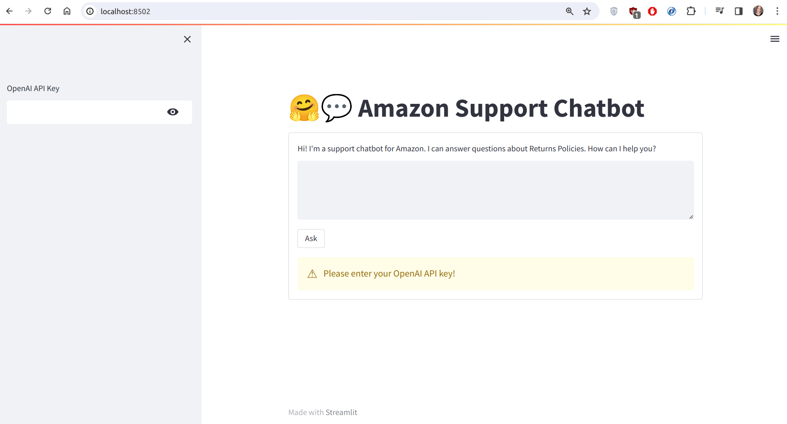
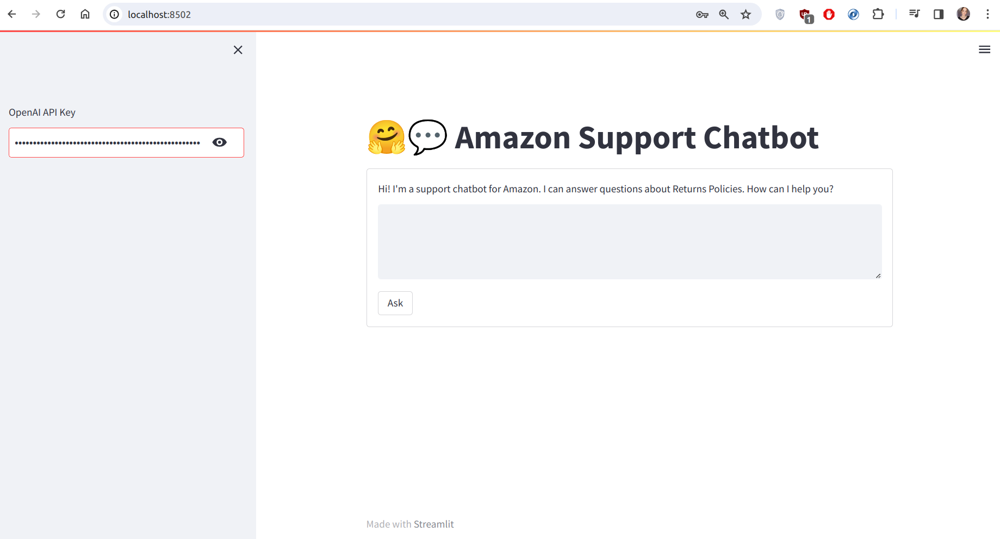
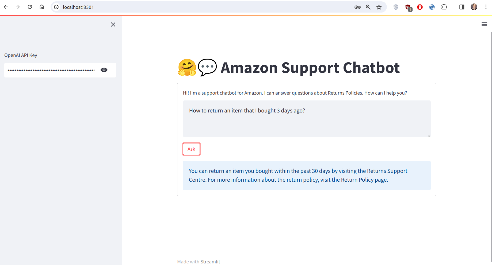
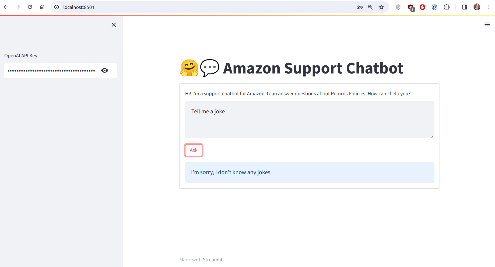

# 🤗💬 Amazon Support Chatbot

## LLM app using LangChain

## Project setup

1. Install Python 3.10+ 

2. Create and activate virtual enviroment, running commands in terminal:

   ```bash
   python3 -m venv venv

   source venv/bin/activate
   ```

3. Install all the necessary libraries using command:
  
   ```bash
   pip install -r requirements.txt
   ```

4. Run the project:

   ```bash
   streamlit run app.py
   ```

## How To Use

1. Input your OpenAI API Key:


2. Press ENTER button:


3. Type your question and click Ask button:


4. Don't ask questions not connected with Amazon Return Policy
